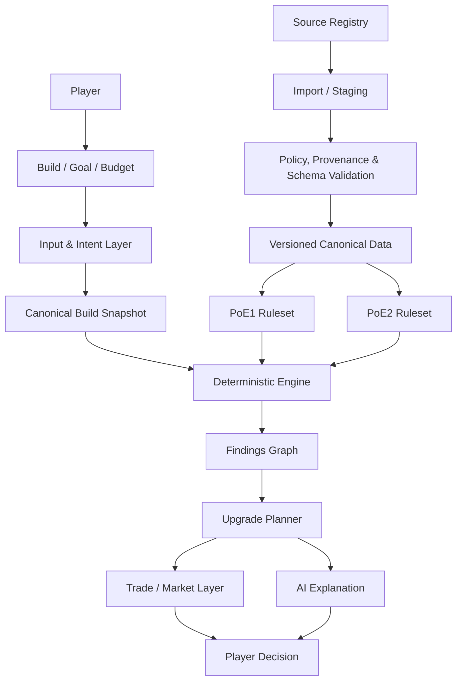

# Lootwright

[Türkçe](README.tr.md)

Lootwright is an open-source Path of Exile intelligence platform for **Path of
Exile 1** and **Path of Exile 2**. Its direction is capability-based,
policy-aware, data-driven, source-agnostic, edition-isolated,
deterministic-first, and AI-assisted.

The intended product connects a player-supplied build, goals, budget, content
target, and locked equipment to traceable findings, an ordered upgrade graph,
and edition-appropriate Trade and market context. Every conclusion should make
its edition, ruleset, evidence, provenance, uncertainty, and dependencies
inspectable.

> This product isn't affiliated with or endorsed by Grinding Gear Games in any way.

Lootwright is currently a **pre-production project**, not a completed public
service. The repository contains substantial working foundations and a narrow
PoE1 deterministic engine, but the complete product experience described below
is not yet available. PoE1 is the active release track. PoE2 has isolated domain
and adapter foundations and will ship independently when its data, rules, and
end-to-end behavior are verified.

## Capability status

The labels in this README have precise meanings:

- **AVAILABLE** — implemented and exercised in the repository. Deployment may
  still require operator configuration.
- **EXPERIMENTAL** — implemented in a limited, fixture-backed, or pre-release
  form and not a production-readiness claim.
- **CONDITIONAL** — implemented or designed behind source, policy, provenance,
  configuration, or operational gates.
- **PLANNED** — product direction with no claim that an end-to-end capability
  currently works.

| Area | Status | Current repository evidence |
| --- | --- | --- |
| Laravel application, authentication, member ownership, admin RBAC, audit log | **AVAILABLE** | Fortify-backed auth, verified member routes, owner policies, admin/super-admin controls, 2FA and recent-password gates are implemented and feature-tested. Production mail and staging operations still require configuration. |
| Source Registry, Policy and Provenance Gate, immutable snapshots, staging, import reports, versioned rulesets | **AVAILABLE** | PostgreSQL-oriented persistence and deny-by-default capability decisions exist, with idempotency, quarantine, approval, activation history, and isolation tests. |
| Safe PoB1 parsing and normalization | **AVAILABLE** | User-supplied PoB1 XML/share-code input has bounded decoding, decompression and XML parsing, edition detection, typed unsupported fields, and no remote-resource resolution. It is not full Path of Building calculation parity. |
| PoE1 character catalog and analysis intake | **AVAILABLE** | The public catalog and wizard currently expose PoE1. Class/Ascendancy relationships are validated server-side. |
| PoE1 deterministic findings | **CONDITIONAL** | A real, narrow engine is production-bound and uses an exact approved immutable ruleset and passive-tree snapshot. It fails closed when that data is absent or incompatible. Its rule coverage is intentionally incomplete. |
| Upgrade graph and manual Trade recipe engine | **EXPERIMENTAL** | Edition-scoped deterministic contracts, ordering, constraints, dependency handling, and human-readable recipe generation are tested. Production output still needs approved canonical modifier and Trade vocabulary data and full workflow/UI binding. |
| PoE2 format and domain adapters | **EXPERIMENTAL** | Separate PoB2-shaped parsing, catalog/domain contracts, rule registry, item-text and Trade vocabulary boundaries exist with cross-edition tests. There is no approved PoE2 production ruleset or analyzer, and PoE2 is not a public release surface today. |
| GGG PoE1 passive-tree import | **CONDITIONAL** | An operator-only, commit-pinned, allowlisted importer stages and validates the official export before atomic activation. It is disabled by default and never runs in a player request. |
| poe.ninja economy observations | **CONDITIONAL** | A documented-economy adapter, bounded client, normalization, caching, freshness, and policy tests exist. It is disabled by default and is not canonical game truth. |
| PoE Wiki ingestion | **CONDITIONAL** | A disabled adapter boundary exists. Activation requires a reviewed capability, terms/attribution decision, exact schema, and current provenance evidence. |
| Remote build links such as `pobb.in` or future PoB2-compatible providers | **PLANNED** | Locally supplied content remains the supported intake path. Remote retrieval requires a separately approved, allowlisted adapter; arbitrary user-controlled URL fetching is not implemented. |
| Optional AI intent/explanations | **CONDITIONAL** | A provider-neutral gateway and default-off OpenAI Responses adapter implement schemas, quotas, budgets, caching, timeout/retry limits, a circuit breaker, and deterministic fallback. Normal CI uses fakes. |
| Live Trade/market intelligence and price-aware planning | **PLANNED / CONDITIONAL** | Capability levels are defined below. No current production flow promises live listings or exact prices. |

For the strict release verdict, see [MVP readiness](docs/release/mvp-readiness.md).
For implementation history and limitations, see [progress](docs/progress.md) and
the [current-state audit](docs/audits/current-state.md).

## Target player experience

Lootwright is being built so that a player can eventually:

1. choose PoE1 or PoE2;
2. import or provide a build through a supported input adapter;
3. describe goals naturally and select a content target;
4. specify a budget and lock equipment or mechanics that must be preserved;
5. receive deterministic, versioned build findings;
6. identify weaknesses and understand the evidence behind them;
7. receive prioritized upgrades with prerequisites, conflicts, and cross-slot
   dependencies;
8. generate an available Trade recipe or search representation;
9. inspect timestamped market observations when an approved provider supports
   them; and
10. compare alternatives and understand why each recommendation exists.

This is the product direction, not a claim that every step is currently
available.

## Dual-edition architecture

PoE1 and PoE2 share contracts, not unverified facts. Every build snapshot,
canonical entity, imported dataset, ruleset, finding, recommendation, recipe,
and market observation carries a game edition.

- Shared contracts define inputs, outputs, provenance, uncertainty, and
  lifecycle behavior.
- PoE1 and PoE2 use separate importers, canonical identifiers, adapters,
  rulesets, analysis rules, content goals, and Trade vocabularies.
- Cross-edition identifiers and fallback are rejected by domain, persistence,
  and architecture tests.
- Each edition has independent data approval, compatibility, release-readiness,
  and kill-switch decisions.
- PoE1 and PoE2 can ship independently. Current public release scope is PoE1;
  that is a readiness decision, not a single-edition product architecture.

## How the system fits together



The domain core under `src/` does not depend on Laravel HTTP, Eloquent, Vue, or
an AI SDK. Laravel infrastructure under `app/` supplies persistence, queues,
policy enforcement, source adapters, and provider integrations. The Vue layer
renders results; it is not an authoritative calculation engine.

## Deterministic analysis and AI

Game-mechanical conclusions originate from four inputs:

1. validated canonical game data;
2. an immutable, edition-scoped ruleset;
3. a normalized canonical build snapshot; and
4. deterministic analysis rules.

The same normalized input, ruleset, parser version, and engine version must
produce the same canonical result. Missing or unsupported information stays
unknown and lowers confidence or blocks a conclusion; it is not filled by a
guess.

AI is not Lootwright's canonical knowledge database. When enabled and allowed,
AI may interpret natural-language intent into a closed schema and explain
already-produced findings or recommendations. Its output is validated against
the selected edition and deterministic result. AI cannot silently change a
ruleset, introduce canonical facts, replace findings, invent market values, or
create an unsupported recommendation. The core workflow is designed to remain
usable with AI disabled.

## Sources and capabilities

Lootwright is source-agnostic at the application boundary, not source-blind.
The Source Registry records each provider and capability independently,
including edition, URLs, allowed and forbidden operations, terms/policy
evidence, storage and redistribution status, review date, provenance state,
configuration state, and emergency kill switch.

Potential sources include Grinding Gear Games, Path of Building Community, PoE
Wiki, poe.ninja, approved open-source datasets, approved community datasets,
and future providers. Listing a source is not approval, availability, or an
endorsement by either party.

Every integration is reviewed independently for technical feasibility,
reliability, permission, authentication, rate limits, applicable terms,
provenance, retention, redistribution, and data quality. A capability can be
enabled, limited, experimental, disabled, or revoked without changing the
status of other capabilities. Remote data enters through import/staging and
validation before it can become versioned canonical data; it is not written
directly into a production ruleset.

Remote build providers such as `pobb.in`, PoB links, PoB2-compatible links, or
other approved build-sharing sources can be added through provider-specific
adapters when technically and policy feasible. External adapters do not accept
arbitrary user-controlled URLs. Build guides, forum information, and community
build discovery can likewise be evaluated when there is an approved access
method, a concrete capability scope, and sufficient provenance; their public
availability alone is not treated as permission.

## Trade and market capability levels

Trade support progresses by independently reviewed capability:

| Level | Capability | Current status |
| --- | --- | --- |
| 0 | Human-readable manual Trade recipe | **EXPERIMENTAL** — engine and fixture UI exist; production vocabulary/data approval remains gated. |
| 1 | Validated edition-specific Trade filters | **PLANNED / CONDITIONAL** — requires approved canonical modifier and filter vocabulary. |
| 2 | Official Trade deep-link or search generation | **PLANNED / CONDITIONAL** — only through a reliable, provider-permitted mechanism; no availability promise. |
| 3 | Market observations | **CONDITIONAL** — the poe.ninja economy adapter is default-off; other providers require separate review. |
| 4 | Price-aware upgrade planning | **PLANNED** — requires suitable timestamped observations and uncertainty-aware planning. |

No level implies purchasing, whispering, inviting, or acting for the player.
When a provider does not support a safe structured search representation,
Lootwright can still present human-readable filters for manual use.

Prices are observations, not facts. Any market estimate must carry its game
edition, league, source, timestamp, and—where possible—confidence, sample, or
coverage context. Lootwright does not promise exact prices, current listings,
or execution at an observed value.

## Security and privacy boundaries

Lootwright does not exist to control the game client, inspect process memory,
inject code, automate combat or movement, steal credentials, circumvent access
controls, or bypass provider rate limits. It does not automate purchases,
whispers, invites, or gameplay.

No integration may circumvent access controls, authentication requirements,
technical restrictions, rate limits, or applicable provider policies. Every
integration must be individually reviewed and capability-scoped.

Player input and remote data are treated as hostile. Importers enforce encoded,
decoded, decompressed, nesting, count, and time bounds. XML DTDs, external
entities, and remote-resource resolution are disabled. Outbound HTTP uses fixed
adapter allowlists and SSRF defenses. The application applies authorization,
CSRF protection, rate limits, idempotency, secret/log redaction, encrypted
storage where required, retention limits, export, and deletion controls.

Lootwright minimizes data sent to optional AI providers and does not require
game-session cookies or passwords. Raw builds, item text, prompts, tokens, and
session secrets must not appear in logs or analytics.

See the [threat model](docs/security/threat-model.md), [security baseline](docs/security/security-baseline.md), and [source register](docs/compliance/source-register.md).

## Technology in this repository

- PHP 8.4 and Laravel 13 modular monolith
- Laravel Fortify authentication and Horizon for supported local/self-hosted
  queue operation
- PostgreSQL as the production system of record
- Laravel cache, queue, filesystem, HTTP, and encryption abstractions; Redis is
  available in the local Docker stack, while Laravel Cloud resources are
  provisioned only when needed
- Inertia 3, Vue 3 Composition API, TypeScript, Tailwind CSS 4, Vite 8, and
  reviewed vendored shadcn-vue-style components built on Reka UI
- PHPUnit 12, Larastan/PHPStan, Laravel Pint, ESLint, Vitest, and Playwright
- Composer and npm lockfiles; Node.js 24 and npm 11 baseline

Deployment assets include a local Docker Compose stack, a production container
definition, and Laravel Cloud documentation. This repository does not claim a
production deployment has occurred.

## Roadmap

| Phase | Status | Evidence and next gate |
| --- | --- | --- |
| Phase A — Platform Foundation | **AVAILABLE / ongoing** | Modular boundaries, identity, ownership, admin, policy/provenance, source lifecycle, security controls, CI and deployment foundations exist. Real PostgreSQL CI/staging and operational evidence remain release gates. |
| Phase B — PoE1 Functional Engine | **EXPERIMENTAL / CONDITIONAL** | Safe PoB1 intake, official passive-tree import, exact ruleset resolution, and a narrow deterministic finding set exist. Broader canonical data, rules, production upgrades/recipes, and result UX remain incomplete. |
| Phase C — PoE2 Functional Engine | **PLANNED** | Edition-isolated contracts and beta structural adapters exist; approved canonical data, ruleset, analyzer, public flow, and production tests do not. |
| Phase D — Trade & Market Intelligence | **EXPERIMENTAL / CONDITIONAL** | Level 0 contracts and a default-off poe.ninja economy adapter exist. Higher levels depend on provider capability, policy, provenance, and data quality. |
| Phase E — Advanced Build Intelligence | **PLANNED** | Build comparison, gear what-if simulation, passive-tree comparison, upgrade ROI, league analysis, meta statistics, build-guide ingestion, community discovery, historical markets, feedback loops, and recommendation evaluation remain future capabilities. |
| Phase F — Production Hardening | **IN PROGRESS** | Parser, auth, authorization, queue, logging, outbound, AI, and migration controls have broad tests. PostgreSQL/staging, mail, proxy/TLS, backup restore, and aggregate browser gates still require evidence. |

Roadmap items are architectural room, not delivery promises. A future provider
or workflow becomes available only after its own implementation and review.

## Local development

Required baseline: PHP 8.4, Composer 2, Node.js 24, npm 11, PostgreSQL, and the
PHP `dom`, `zlib`, and `pdo_pgsql` extensions.

### Docker on Linux or WSL2

```bash
cp .env.example .env
composer run setup:docker
composer run dev:docker
```

### Host or Windows web-only workflow

```bash
cp .env.example .env
composer run setup
composer run dev
```

On Windows without Horizon's `pcntl`/`posix` extensions:

```powershell
composer run setup:windows
composer run dev:web
```

## Quality gates

```powershell
composer validate --strict
composer audit
composer run format:check
composer run analyse
composer run ci:guardrails
composer run test
npm ci
npm audit --audit-level=high
npm run lint
npm run typecheck
npm run test
npm run build
powershell.exe -NoProfile -ExecutionPolicy Bypass -File scripts/validate-docs.ps1
```

PostgreSQL-specific migration tests and browser E2E tests are separate release
evidence; SQLite-only success is not PostgreSQL proof.

## Contributing and independence

Read [CONTRIBUTING.md](CONTRIBUTING.md) and `AGENTS.md` before changing the
project. Contributions must preserve edition isolation, explicit provenance,
immutable/versioned rules, deterministic traceability, uncertainty, security
boundaries, and automated tests. Source or capability changes require a scoped
policy review rather than an assumption based on technical accessibility.

Lootwright is independent. It is not affiliated with or endorsed by Grinding
Gear Games, OpenAI, PoE Wiki, poe.ninja, Path of Building, or any other source
or provider.

Lootwright-original code and documentation are MIT licensed. Third-party game
data, user submissions, trademarks, and provider material are not relicensed by
this repository. See [LICENSE-SCOPE.md](LICENSE-SCOPE.md), [THIRD_PARTY_NOTICES.md](THIRD_PARTY_NOTICES.md), and [SECURITY.md](SECURITY.md).
