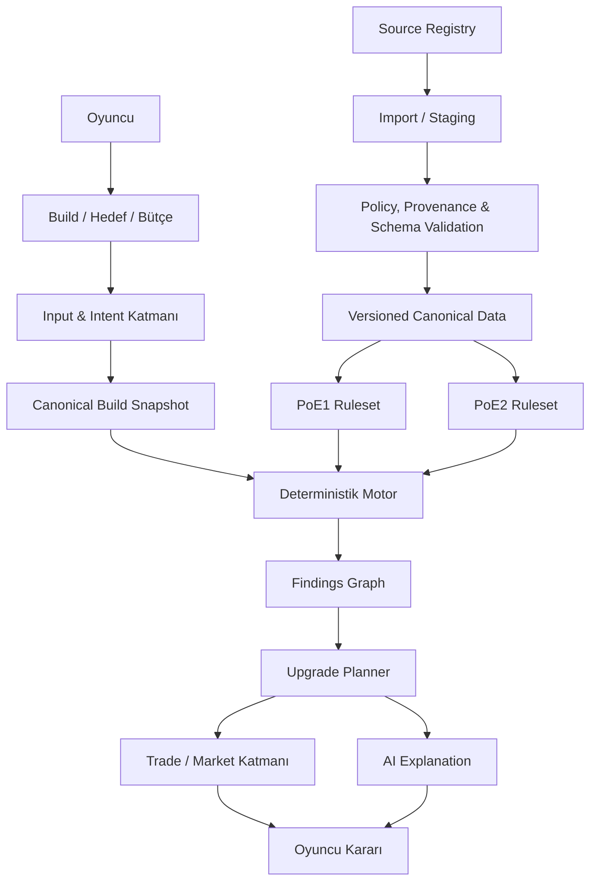

# Lootwright

[English](README.md)

Lootwright, **Path of Exile 1** ve **Path of Exile 2** için geliştirilen açık
kaynaklı bir Path of Exile intelligence platformudur. Ürün yaklaşımı;
yetenek-bazlı, politika-duyarlı, veri-odaklı, kaynak-bağımsız,
oyun-sürümü-yalıtımlı, deterministik-öncelikli ve AI-desteklidir.

Hedeflenen ürün; oyuncunun sağladığı build'i, hedefleri, bütçeyi, içerik
tercihini ve korunmasını istediği ekipmanı izlenebilir bulgulara, sıralı upgrade
grafiğine ve oyuna uygun Trade/piyasa bağlamına dönüştürür. Her sonucun oyun
sürümü, ruleset'i, kanıtı, provenance'ı, belirsizliği ve bağımlılıkları
incelenebilir olmalıdır.

> This product isn't affiliated with or endorsed by Grinding Gear Games in any way.

Lootwright şu anda tamamlanmış halka açık bir servis değil, **production öncesi
bir projedir**. Repoda güçlü bir platform temeli ve dar kapsamlı gerçek bir PoE1
deterministik motoru bulunur; ancak aşağıdaki ürün deneyiminin tamamı henüz
kullanılabilir değildir. Aktif release hattı PoE1'dir. PoE2 için yalıtılmış
domain ve adapter temelleri vardır; PoE2 verileri, kuralları ve uçtan uca
davranışı doğrulandığında bağımsız olarak yayınlanacaktır.

## Yetenek durumları

Bu README'deki etiketlerin anlamı nettir:

- **AVAILABLE** — repoda uygulanmış ve test edilmiştir. Deployment sırasında
  operatör yapılandırması yine de gerekebilir.
- **EXPERIMENTAL** — sınırlı, fixture-backed veya release öncesi uygulamadır;
  production hazırlığı iddiası değildir.
- **CONDITIONAL** — kaynak, politika, provenance, config veya operasyon
  kapılarının arkasında uygulanmış ya da tasarlanmıştır.
- **PLANNED** — ürün yönüdür; uçtan uca çalıştığı iddia edilmez.

| Alan | Durum | Mevcut repo kanıtı |
| --- | --- | --- |
| Laravel uygulaması, authentication, üye sahipliği, admin RBAC ve audit log | **AVAILABLE** | Fortify auth akışları, doğrulanmış üye routeları, ownership policy'leri, admin/super-admin kontrolleri, 2FA ve recent-password kapıları uygulanmış ve feature testlerle doğrulanmıştır. Production mail ve staging operasyonları yapılandırılmalıdır. |
| Source Registry, Policy and Provenance Gate, immutable snapshot, staging, import raporu ve versioned ruleset | **AVAILABLE** | PostgreSQL hedefli persistence; idempotency, quarantine, approval, activation history ve edition isolation testleriyle uygulanmıştır. |
| Güvenli PoB1 parse ve normalization | **AVAILABLE** | Kullanıcının sağladığı PoB1 XML/share code için boyutlu decode, decompression ve XML sınırları, edition detection ve tipli unsupported alanlar vardır. Uzak XML kaynağı çözülmez. Bu, Path of Building hesaplamalarıyla tam parity anlamına gelmez. |
| PoE1 karakter kataloğu ve analiz girişi | **AVAILABLE** | Public katalog ve wizard şu anda PoE1'i sunar. Class/Ascendancy ilişkisi backend tarafından tekrar doğrulanır. |
| PoE1 deterministik bulguları | **CONDITIONAL** | Gerçek fakat dar kapsamlı motor production container'a bağlıdır; tam eşleşen onaylı immutable ruleset ve passive-tree snapshot kullanır. Veri yoksa veya uyumsuzsa fail closed davranır. Kural kapsamı bilinçli olarak sınırlıdır. |
| Upgrade grafiği ve manuel Trade recipe motoru | **EXPERIMENTAL** | Edition-scoped deterministik contract'lar, sıralama, constraint, dependency ve human-readable recipe üretimi testlidir. Production çıktısı için onaylı canonical modifier/Trade vocabulary ve tam workflow/UI bağlantısı gerekir. |
| PoE2 format ve domain adapterları | **EXPERIMENTAL** | Ayrı PoB2-shaped parser, katalog/domain contract'ları, rule registry, item-text ve Trade vocabulary sınırları cross-edition testlerle bulunur. Onaylı PoE2 production ruleset/analyzer yoktur ve PoE2 bugün public release yüzeyi değildir. |
| GGG PoE1 passive-tree import | **CONDITIONAL** | Operatör kontrollü, commit-pinned ve allowlist'li importer resmî export'u atomic activation öncesinde stage edip doğrular. Varsayılan kapalıdır ve oyuncu isteği sırasında çalışmaz. |
| poe.ninja ekonomi gözlemleri | **CONDITIONAL** | Dokümante economy adapterı, bounded client, normalization, cache, freshness ve policy testleri vardır. Varsayılan kapalıdır; canonical oyun gerçeği değildir. |
| PoE Wiki ingestion | **CONDITIONAL** | Devre dışı adapter sınırı vardır. Etkinleştirme için capability, lisans/atıf, şema ve güncel provenance incelemesi gerekir. |
| `pobb.in`, PoB linkleri ve gelecekteki PoB2-compatible providerlar | **PLANNED** | Bugün desteklenen giriş, kullanıcının doğrudan sağladığı içeriktir. Remote retrieval ayrı, allowlist'li ve onaylı adapter gerektirir; keyfî kullanıcı URL'si fetch edilmez. |
| İsteğe bağlı AI intent/explanation | **CONDITIONAL** | Provider-neutral gateway ve varsayılan kapalı OpenAI Responses adapterı; schema, kota, bütçe, cache, timeout/retry, circuit breaker ve deterministik fallback uygular. Normal CI fake kullanır. |
| Canlı Trade/piyasa intelligence ve price-aware planlama | **PLANNED / CONDITIONAL** | Capability seviyeleri aşağıda tanımlıdır. Bugünkü production akışı canlı listing veya kesin fiyat vadetmez. |

Kesin release kararı için [MVP readiness](docs/release/mvp-readiness.md), uygulama
tarihi ve sınırlamalar için [progress](docs/progress.md) ile
[current-state audit](docs/audits/current-state.md) belgelerine bakın.

## Hedef oyuncu deneyimi

Lootwright, oyuncunun gelecekte şunları yapabilmesi için geliştiriliyor:

1. PoE1 veya PoE2 seçmek;
2. desteklenen bir input adapterı üzerinden build sağlamak;
3. hedeflerini doğal dille anlatmak ve içerik hedefini seçmek;
4. bütçe belirtmek, korunacak ekipman veya mekanikleri kilitlemek;
5. deterministik ve versioned build bulguları almak;
6. zayıflıkları ve bunların kanıtlarını görmek;
7. prerequisite, conflict ve cross-slot dependency içeren öncelikli upgrade'ler
   almak;
8. kullanılabilir bir Trade recipe veya search temsili üretmek;
9. uygun ve onaylı provider varsa timestamp taşıyan piyasa gözlemlerini görmek;
10. alternatifleri karşılaştırmak ve her önerinin nedenini anlamak.

Bu liste ürün yönüdür; bütün adımların bugün available olduğu anlamına gelmez.

## PoE1 ve PoE2 mimarisi

PoE1 ile PoE2 doğrulanmamış oyun gerçeklerini değil, ortak contract'ları paylaşır.
Her build snapshot, canonical entity, imported dataset, ruleset, finding,
recommendation, recipe ve market observation açık bir game edition taşır.

- Ortak contract'lar input, output, provenance, uncertainty ve lifecycle
  davranışını tanımlar.
- PoE1 ve PoE2; ayrı importer, canonical identifier, adapter, ruleset, analysis
  rule, content goal ve Trade vocabulary kullanır.
- Cross-edition identifier ve fallback, domain/persistence/architecture
  testleriyle reddedilir.
- Her oyun için data approval, compatibility, release readiness ve kill switch
  kararı bağımsızdır.
- PoE1 ile PoE2 birbirinden bağımsız yayınlanabilir. Bugünkü public release
  kapsamı PoE1'dir; bu tek oyunlu mimari değil, readiness kararıdır.

## Sistem akışı



`src/` altındaki domain çekirdeği Laravel HTTP, Eloquent, Vue veya AI SDK'sına
bağımlı değildir. `app/` altındaki Laravel infrastructure; persistence, queue,
policy enforcement, source adapter ve provider entegrasyonlarını sağlar. Vue
katmanı sonuçları sunar, authoritative hesaplama yapmaz.

## Deterministik analiz ve AI

Oyun mekaniklerine ilişkin sonuçlar dört girdiden doğar:

1. doğrulanmış canonical oyun verisi;
2. immutable ve edition-scoped ruleset;
3. normalize edilmiş canonical build snapshot;
4. deterministik analysis rule'ları.

Aynı normalized input, ruleset, parser version ve engine version aynı canonical
sonucu üretmelidir. Eksik veya unsupported bilgi `unknown` kalır; confidence'ı
düşürür veya sonucu engeller, tahminle doldurulmaz.

AI, Lootwright'ın canonical bilgi veritabanı değildir. Açık ve izinli olduğunda
natural-language intent'i kapalı bir schema'ya dönüştürebilir ve önceden üretilmiş
finding/recommendation'ları açıklayabilir. Çıktısı seçilen edition ve
deterministik sonuçla doğrulanır. AI sessizce ruleset değiştiremez, canonical
fact ekleyemez, finding'i değiştiremez, market değeri uyduramaz veya unsupported
recommendation oluşturamaz. Çekirdek akış AI kapalıyken de çalışacak şekilde
tasarlanmıştır.

## Kaynaklar ve capability yönetimi

Lootwright uygulama sınırında source-agnostic'tir; kaynakların niteliğine karşı
kayıtsız değildir. Source Registry her provider/capability için edition, URL,
izinli ve yasak operasyon, terms/policy evidence, storage/redistribution durumu,
review tarihi, provenance, config ve emergency kill switch bilgisini ayrı tutar.

Olası kaynaklar arasında Grinding Gear Games, Path of Building Community, PoE
Wiki, poe.ninja, onaylı açık kaynak da
taset'ler, onaylı community dataset'leri ve
gelecekteki providerlar bulunabilir. Bir kaynağın listelenmesi; onay, availability
veya karşılıklı endorsement anlamına gelmez.

Her entegrasyon teknik uygulanabilirlik, güvenilirlik, izin, authentication,
rate limit, geçerli terms, provenance, retention, redistribution ve data quality
açısından bağımsız incelenir. Bir capability diğerlerinden bağımsız biçimde
enabled, limited, experimental, disabled veya revoked olabilir. Remote veri
production ruleset'e doğrudan yazılmaz; import/staging ve validation aşamalarını
geçtikten sonra versioned canonical data olabilir.

`pobb.in`, PoB linkleri, PoB2-compatible linkler ve başka onaylı build-sharing
providerları, teknik ve politika koşulları sağlandığında provider-specific
adapterlarla eklenebilir. External adapterlar keyfî user-controlled URL kabul
etmez. Build guide, forum bilgisi ve community build discovery de onaylı bir
erişim yöntemi, somut capability scope ve yeterli provenance bulunduğunda ayrı
ayrı değerlendirilebilir; içeriğin public olması tek başına izin sayılmaz.

## Trade ve piyasa capability seviyeleri

Trade desteği bağımsız incelemelerden geçen seviyelerle ilerler:

| Seviye | Capability | Bugünkü durum |
| --- | --- | --- |
| 0 | Human-readable manuel Trade recipe | **EXPERIMENTAL** — motor ve fixture UI vardır; production vocabulary/data onayı gated durumdadır. |
| 1 | Doğrulanmış edition-specific Trade filter'ları | **PLANNED / CONDITIONAL** — canonical modifier ve filter vocabulary onayı gerekir. |
| 2 | Resmî Trade deep link veya search generation | **PLANNED / CONDITIONAL** — yalnız güvenilir ve provider tarafından izin verilen yöntemle; availability sözü verilmez. |
| 3 | Market observation | **CONDITIONAL** — poe.ninja economy adapterı varsayılan kapalıdır; diğer providerlar ayrı review gerektirir. |
| 4 | Price-aware upgrade planning | **PLANNED** — uygun timestamped observation ve uncertainty-aware planlama gerekir. |

Hiçbir seviye oyuncu adına satın alma, whisper, invite veya başka bir işlem
yapılması anlamına gelmez. Provider güvenli structured search temsili sunmuyorsa
Lootwright yine manuel uygulanacak human-readable filter'lar gösterebilir.

Fiyatlar gerçek değil, gözlemdir. Her market estimate; edition, league, source,
timestamp ve mümkünse confidence, sample veya coverage bağlamı taşımalıdır.
Lootwright kesin fiyat, güncel listing ya da gözlenen değerden işlem garantisi
vermez.

## Güvenlik ve gizlilik sınırları

Lootwright; oyun istemcisini kontrol etmek, process memory okumak, kod inject
etmek, combat veya movement otomasyonu yapmak, credential çalmak, access control
aşmak ya da provider rate limitlerini bypass etmek için geliştirilmez. Purchase,
whisper, invite veya gameplay otomasyonu yapmaz.

Hiçbir entegrasyon access control, authentication requirement, teknik kısıt,
rate limit veya geçerli provider policy'lerini aşamaz. Her entegrasyon bağımsız
olarak incelenmeli ve capability-scoped olmalıdır.

Oyuncu girdisi ve remote veri hostile kabul edilir. Importer'lar encoded,
decoded, decompressed boyutlarını; nesting, adet ve süreyi sınırlar. XML DTD,
external entity ve remote-resource resolution kapalıdır. Outbound HTTP yalnız
sabit adapter allowlist'leri ve SSRF korumasıyla çalışır. Uygulama authorization,
CSRF, rate limit, idempotency, secret/log redaction, gerektiğinde encryption,
retention, export ve deletion kontrolleri uygular.

Opsiyonel AI providerlarına gönderilen veri minimize edilir. Lootwright oyun
session cookie'si veya şifresi gerektirmez. Raw build, item text, prompt, token ve
session secret log veya analytics'e yazılmamalıdır.

[Threat model](docs/security/threat-model.md), [security baseline](docs/security/security-baseline.md) ve [source register](docs/compliance/source-register.md) ayrıntıları içerir.

## Repodaki gerçek teknoloji yığını

- PHP 8.4 ve Laravel 13 modular monolith
- Laravel Fortify authentication; desteklenen local/self-hosted queue çalışması
  için Horizon
- Production system of record olarak PostgreSQL
- Laravel cache, queue, filesystem, HTTP ve encryption abstraction'ları; local
  Docker stack'te Redis, Laravel Cloud'da ise yalnız gerektiğinde provision
  edilen kaynaklar
- Inertia 3, Vue 3 Composition API, TypeScript, Tailwind CSS 4, Vite 8 ve Reka UI
  üzerinde incelenmiş vendored shadcn-vue tarzı component'ler
- PHPUnit 12, Larastan/PHPStan, Laravel Pint, ESLint, Vitest ve Playwright
- Composer/npm lockfile'ları; Node.js 24 ve npm 11 baseline

Repo; local Docker Compose stack'i, production container tanımı ve Laravel Cloud
dokümantasyonu içerir. Production deployment yapılmış olduğu iddia edilmez.

## Yol haritası

| Faz | Durum | Kanıt ve sonraki kapı |
| --- | --- | --- |
| Phase A — Platform Foundation | **AVAILABLE / devam ediyor** | Module boundary, identity, ownership, admin, policy/provenance, source lifecycle, security, CI ve deployment temelleri vardır. Gerçek PostgreSQL CI/staging ve operasyon kanıtları release gate olmaya devam eder. |
| Phase B — PoE1 Functional Engine | **EXPERIMENTAL / CONDITIONAL** | Güvenli PoB1 intake, resmî passive-tree import, exact ruleset resolution ve dar deterministik finding seti vardır. Daha geniş canonical data/rule, production upgrade/recipe ve result UX eksiktir. |
| Phase C — PoE2 Functional Engine | **PLANNED** | Edition-isolated contract ve beta structural adapter vardır; onaylı canonical data, ruleset, analyzer, public akış ve production test yoktur. |
| Phase D — Trade & Market Intelligence | **EXPERIMENTAL / CONDITIONAL** | Level 0 contract'ları ve default-off poe.ninja economy adapterı vardır. Üst seviyeler provider capability, policy, provenance ve data quality'ye bağlıdır. |
| Phase E — Advanced Build Intelligence | **PLANNED** | Build comparison, gear what-if simulation, passive-tree comparison, upgrade ROI, league analysis, meta statistics, build-guide ingestion, community discovery, historical market, feedback loop ve recommendation evaluation gelecekteki capability'lerdir. |
| Phase F — Production Hardening | **DEVAM EDİYOR** | Parser, auth, authorization, queue, logging, outbound, AI ve migration kontrolleri geniş test kapsamına sahiptir. PostgreSQL/staging, mail, proxy/TLS, backup restore ve aggregate browser kapıları için ek kanıt gerekir. |

Roadmap maddeleri mimari alan bırakır; teslimat sözü değildir. Yeni provider veya
workflow ancak kendi implementasyon ve review süreci tamamlandığında available
olur.

## Yerel geliştirme

Gerekli baseline: PHP 8.4, Composer 2, Node.js 24, npm 11, PostgreSQL ve PHP
`dom`, `zlib`, `pdo_pgsql` extension'ları.

### Linux veya WSL2 üzerinde Docker

```bash
cp .env.example .env
composer run setup:docker
composer run dev:docker
```

### Host veya Windows web-only akışı

```bash
cp .env.example .env
composer run setup
composer run dev
```

Windows'ta Horizon'ın `pcntl`/`posix` extension'ları yoksa:

```powershell
composer run setup:windows
composer run dev:web
```

## Kalite kapıları

```powershell
composer validate --strict
composer audit
composer run format:check
composer run analyse
composer run ci:guardrails
composer run test
npm ci
npm audit --audit-level=high
npm run lint
npm run typecheck
npm run test
npm run build
powershell.exe -NoProfile -ExecutionPolicy Bypass -File scripts/validate-docs.ps1
```

PostgreSQL migration testleri ve browser E2E ayrı release kanıtıdır. Yalnız
SQLite başarısı PostgreSQL uyumluluk kanıtı sayılmaz.

## Katkı ve bağımsızlık

Değişiklik yapmadan önce [CONTRIBUTING.md](CONTRIBUTING.md) ve `AGENTS.md`
dosyalarını okuyun. Katkılar edition isolation, açık provenance,
immutable/versioned rules, deterministic traceability, uncertainty, security
boundary ve otomatik testleri korumalıdır. Kaynak/capability değişikliği, teknik
erişilebilirliğe dayanarak varsayılmamalı; scoped policy review gerektirmelidir.

Lootwright bağımsızdır. Grinding Gear Games, OpenAI, PoE Wiki, poe.ninja, Path of
Building veya başka bir kaynak/provider ile bağlantılı değildir ve bunlar
tarafından desteklenmemektedir.

Lootwright'a ait özgün kod ve dokümantasyon MIT lisanslıdır. Üçüncü taraf oyun
verileri, kullanıcı girdileri, markalar ve provider materyalleri bu repo
tarafından yeniden lisanslanmaz. [LICENSE-SCOPE.md](LICENSE-SCOPE.md),
[THIRD_PARTY_NOTICES.md](THIRD_PARTY_NOTICES.md) ve [SECURITY.md](SECURITY.md)
belgelerine bakın.
