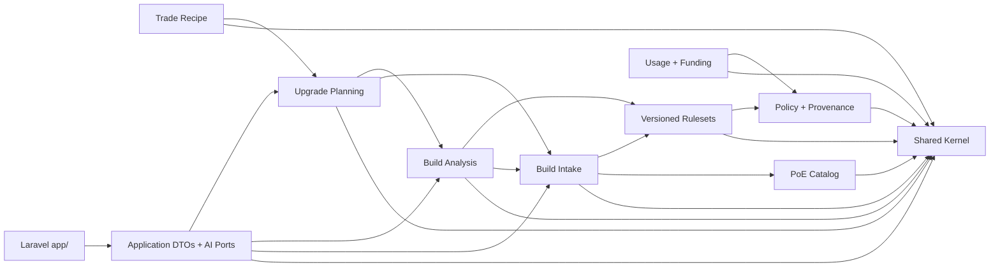

# Domain Foundation

Lootwright's framework-independent PHP foundation lives under `src/`. It has no
Laravel service-container, Eloquent, HTTP, queue, cache, filesystem, UI, or
provider-SDK dependency. Framework delivery and infrastructure remain under
`app/` and may depend inward through public application and domain APIs.

## Namespace layout

| Namespace | Directory | Ownership |
| --- | --- | --- |
| `Lootwright\Domain\Shared` | `src/Domain/Shared` | Game scope, UUIDv7 IDs, edition-scoped versions, locale, decimal budget, typed errors, canonical JSON, rule references, and explanation traces |
| `Lootwright\Domain\BuildIntake` | `src/Domain/BuildIntake` | Player intent, validated parser snapshots, canonical builds, and the normalization port |
| `Lootwright\Domain\PoeCatalog` | `src/Domain/PoeCatalog` | Opaque edition-scoped catalog identifiers and canonical item/build selections; no real catalog data |
| `Lootwright\Domain\Rulesets` | `src/Domain/Rulesets` | Immutable ruleset identity and exact-resolution port |
| `Lootwright\Domain\Analysis` | `src/Domain/Analysis` | Evidence-backed finding contracts and the deterministic analyzer port; no formulas yet |
| `Lootwright\Domain\Recommendations` | `src/Domain/Recommendations` | Upgrade priority, impact, alternative, and recommendation contracts; no ranking formula yet |
| `Lootwright\Domain\TradePlanning` | `src/Domain/TradePlanning` | Descriptive required, weighted, and excluded filter contracts; no Trade IDs, payloads, URLs, or calls |
| `Lootwright\Domain\PolicyProvenance` | `src/Domain/PolicyProvenance` | Data sources and versions, access/source types, capability rules, permission evidence and effective periods, decisions/reasons, kill switches, the pure evaluator, and the authorization port |
| `Lootwright\Domain\UsageFunding` | `src/Domain/UsageFunding` | Usage-policy port and the structurally disabled funding baseline |
| `Lootwright\Application` | `src/Application` | Provider-neutral AI/workflow ports plus checksum-bound manual-recipe DTOs, exact ranges, serialization, unresolved requirements, and use cases; domain entities never depend on these DTOs |

PoE1 and PoE2 adapter namespaces are intentionally absent until an approved
parser or ruleset source exists. Opaque shared identifier types carry a mandatory
`GameEdition`; they are not shared game data or mappings.

## Dependency direction

No arrow may be reversed. `tests/Architecture/DomainBoundaryTest.php` scans every
pure source file, rejects framework/delivery/provider imports, verifies this
domain-module dependency matrix, and prevents future PoE1/PoE2 adapters from
importing each other.

## Invariant and error strategy

- Domain objects are immutable. Constructors that can receive invalid state are
  private; named factories return `DomainResult` containing either a value or a
  typed `DomainError`/`DomainErrorCode`.
- `BuildId`, `AnalysisId`, and `RulesetId` accept canonical lowercase UUIDv7
  values supplied by an application boundary. The deterministic domain does not
  generate IDs from clocks or randomness.
- Every game-sensitive ID, version, snapshot, rule, finding, recommendation,
  and recipe carries or is enclosed by a non-null `GameEdition`.
- A `CanonicalBuild` can exist only when snapshot and ruleset edition, patch,
  league, and parser version match exactly. There is no latest-version or
  cross-game fallback.
- Budgets store normalized decimal strings and currency codes. No float, live
  price, market source, or availability claim is implied. `PriceConfidence`
  explicitly allows `unknown`.
- `CanonicalJson` sorts associative keys, preserves declared list order, and
  uses stable JSON flags. Serialized edition-scoped values include their game
  identity; unsupported editions fail at deserialization.

## Ports and DTOs

Ports are declared by their owning boundary: build normalization in Build
Intake, ruleset resolution in Versioned Rulesets, deterministic analysis in
Build Analysis, upgrade planning in Recommendations, recipe compilation in
Trade Planning, capability authorization in Policy and Provenance, and usage
authorization in Usage and Funding. Optional intent/explanation AI ports live in
the application layer because AI is not a domain authority.

The Laravel adapter under `app/Modules/PolicyProvenance` owns policy tables,
seeded defaults, decision auditing, evidence management, and kill-switch
persistence. It hydrates the pure evaluator through the domain-owned
`CapabilityPolicy` port. `allow` is the only executable outcome;
`require_review` fails closed.

Application commands and queries under `src/Application` are transport-neutral
DTOs. They may carry domain values inward, but they are not domain entities and
cannot be imported by `src/Domain`.

## Deliberately absent

This foundation contains no real class, skill, passive, item, modifier, stat,
affix, league, patch, or currency dataset; no parsing implementation; no
analysis or ranking formula; no provider adapter; no external call; no pricing;
and no funding activation. Fixture identifiers exercise invariants only and do
not assert game facts.
