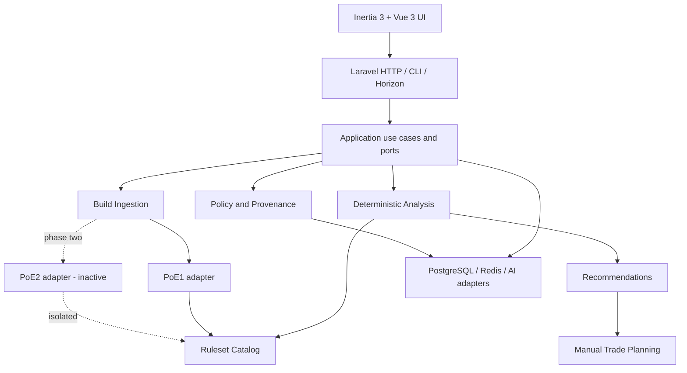

# Module Map

Lootwright uses a Laravel 13 modular monolith with a pure-PHP deterministic core.



Arrows mean permitted dependency or invocation. Domain packages do not point to Laravel infrastructure.

## Planned code ownership

| Location | Responsibility | May depend on | Must not depend on |
| --- | --- | --- | --- |
| `src/Domain/Shared` | Game identity, evidence, provenance references, shared value objects and ports | PHP standard library | Laravel, adapters, storage, AI |
| `src/Domain/BuildIntake` | Player intent, parser snapshots, canonical-build boundary, normalization port | Shared, PoE Catalog, Rulesets | Laravel, persistence, provider SDKs |
| `src/Domain/PoeCatalog` | Opaque game-scoped catalog identifiers and canonical item selections | Shared | real datasets without approved provenance, adapters, Laravel |
| `src/Domain/Rulesets` | Immutable ruleset identity and exact-resolution port | Shared, Policy and Provenance | mutable publication state, Laravel |
| `src/Domain/Analysis` | Deterministic metrics and findings | Shared, Build Intake, Rulesets | HTTP, Eloquent, queues, AI |
| `src/Domain/Recommendations` | Deterministic ranking and explanations-as-data | Shared, Build Intake, Analysis | provider prose, market state |
| `src/Domain/TradePlanning` | Abstract manual filter recipe | Shared, Recommendations | Trade IDs, URLs, browser/API clients |
| `src/Domain/PolicyProvenance` | Sources/versions, permission evidence, exact capability rules, decisions, effective periods, kill switches, and pure evaluation | Shared | external clients, database types, feature-flag overrides |
| `src/Domain/UsageFunding` | Usage port and disabled funding policy | Shared, Policy and Provenance | payment providers, funding entitlements |
| `src/GameAdapters/PoE1` | PoE1 parsing and rule interpretation | shared ports, PoE1 ruleset contracts | PoE2 code, Laravel |
| `src/GameAdapters/PoE2` | PoE2 parsing and rule interpretation | shared ports, PoE2 ruleset contracts | PoE1 code, Laravel |
| `src/Application` | Use cases, commands, queries, provider-neutral ports | all domain packages through public APIs | concrete Laravel/AI SDK types |
| `app/Modules/PolicyProvenance` | Seeded source register, policy persistence, exact capability decisions, audit, evidence administration, and kill-switch adapter | Policy and Provenance port, Laravel | domain formulas, raw user content, provider secrets |
| `app/Modules/Rulesets` | Import, checksum, review, activation, repository adapter | Application ports, Laravel | mutating published rulesets |
| `app/Modules/Builds` | HTTP/jobs/persistence for user submissions | Application ports, Laravel | direct game calculations |
| `app/Modules/AI` | Optional provider adapters and redaction | AI application port, Laravel | authoritative facts or scoring |
| `resources/js` | Inertia pages, Vue components, user interaction | typed page contracts | authoritative analysis |

## Interaction rules

- Public module APIs are typed PHP interfaces and immutable DTOs. Internal classes stay internal.
- A module owns its tables and Eloquent models. Other modules use its application port, not direct queries.
- Synchronous calls are preferred inside the process. Queue only bounded, idempotent work that benefits from retry or latency isolation.
- Laravel events may notify in-process secondary behavior, but event logs are not the source of truth and event sourcing is prohibited.
- Database transactions end at a use-case boundary. Cross-module transactions must be explicit and tested.
- Domain results carry evidence and version identities; presentation may format but not recalculate them.
- New modules require a concrete bounded responsibility and an update to this map.

The detailed namespace and automated dependency matrix are documented in the
[domain foundation](domain-foundation.md).

## Ruleset catalog

Every published ruleset record contains at least:

```text
game
patch
league (nullable only when genuinely league-independent)
source_id
source_version
parser_version
checksum_sha256
published_at
effective_at
provenance_record_id
```

Published content is immutable. Corrections create a new version and supersession link. Activation fails closed if the checksum, parser compatibility, game, or provenance does not match.
