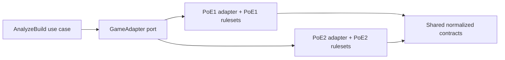

# PoE1 and PoE2 Boundary

Path of Exile 1 and Path of Exile 2 are separate rules domains that happen to implement common application ports.

The adapters do not depend on each other. Shared contracts contain concepts proven to have stable cross-game meaning, not a union of every game-specific field.

## Required identity

Every import, normalized snapshot, item, rule, finding, recommendation, recipe, cache key, job, and database record carries a non-null game value: `poe1` or `poe2`. Parser and ruleset identities include that game value. Deserialization rejects mismatches.

## Shared ports

Shared application ports may express operations such as:

- detect whether an input is supported without guessing its game;
- parse an explicitly game-scoped import;
- normalize game-specific structures into stable evidence facts;
- resolve a game-scoped immutable ruleset;
- analyze through shared finding contracts; and
- compile a descriptive manual recipe through game-specific capabilities.

The port does not promise that both games support the same stats, slots, passive structures, calculations, or recommendation strategies.

## Isolation rules

- Namespaces, directories, ruleset packages, parser versions, cache prefixes, fixtures, database constraints, and test suites are game-scoped.
- Canonical identifiers are opaque game-scoped value objects, never plain strings passed across adapters.
- No fallback from an unknown PoE2 identifier to a PoE1 mapping, or vice versa.
- A shared algorithm may be extracted only after equivalence is demonstrated with fixtures from both games and documented in an ADR or ruleset note.
- UI labels always show the selected game and input-detected conflicts.
- Queue handlers revalidate game identity instead of trusting serialized class names or route parameters.
- Cross-game comparisons are out of scope.

## Dual-game delivery boundary

PoE1 and PoE2 character catalogs, intake, persistence, and wizard selection are
active. Every value remains edition-scoped and cross-game payloads are rejected.
The PoE2 catalog is an Early Access, versioned factual catalog (baseline 0.5)
and does not imply that an unapproved PoE2 ruleset or formula exists. Analysis
adapters must fail closed when a parser or deterministic ruleset is unavailable;
they must never manufacture a result with the other game's rules.

The bounded PoB2 format reader may decode explicitly supplied input. A successful
PoE2 analysis additionally requires an approved parser/ruleset provenance record,
separate fixtures and deterministic conformance tests. Catalog/intake support
therefore remains useful even when a specific ruleset-backed operation is
unavailable.

## Compatibility testing

- Contract tests run independently against each active adapter.
- Negative tests attempt cross-game deserialization, cache reuse, ruleset activation, and identifier injection.
- Snapshot tests include game, parser, ruleset, and checksum metadata.
- A PoE1 test failure cannot be waived because PoE2 produces a similar result.

See [ADR 0003](../adr/0003-poe1-first-delivery.md) and the [module map](module-map.md).
