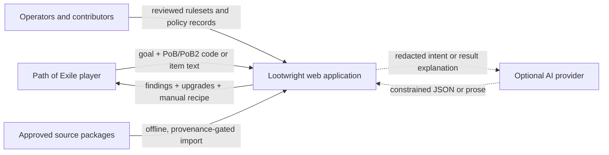

# System Context

Lootwright is a web-only analysis system. The user supplies all build material intentionally; the core does not discover account, client, or market data.

There is intentionally no connection from Lootwright to the game client, official Trade UI, live market, browser session, or undocumented GGG service. The core workflow must operate with the optional AI provider disconnected. Approved source packages are imported offline only after the [Policy and Provenance Gate](../compliance/ggg-integration-policy.md) authorizes their exact source, version, license, use, and checksum.

## People and responsibilities

- The player owns input submission and performs any later Trade-site interaction manually.
- Contributors implement deterministic rules and parsers from approved, recorded sources.
- Maintainers approve source records, ruleset publication, dependency changes, and policy changes.
- Operators deploy one Laravel application with PostgreSQL and the minimum
  enabled cache/queue resources, monitor failures, and enforce retention/deletion.
- Legal/policy reviewers decide questions that engineering cannot infer from silence.

## Trust boundaries

1. Browser to Laravel: hostile public input, authenticated or anonymous.
2. Laravel shell to deterministic core: validated typed commands only.
3. Core to versioned ruleset: immutable package with verified checksum and provenance.
4. Application to optional AI: redacted, schema-constrained, deny-by-default outbound call.
5. Application to persistence/queue: tenant or workspace authorization, encryption, idempotency, retention.
6. Maintainer import to active catalog: two-step review and activation; imported content is untrusted until approved.

## Deployment boundary

The modular monolith is one release artifact and one security boundary. HTTP and
background workers are processes of the same codebase, not separate services.
PostgreSQL is the system of record; cache and queue backends are disposable
coordination state. Local/self-hosted operation may use Redis and Horizon.
Laravel Cloud uses managed cache/queue/background facilities only when required
by an enabled feature. Ruleset artifacts are content-addressed and backed by database
metadata. AI and future documented APIs are replaceable infrastructure adapters,
never domain dependencies.

## Assumptions

- Laravel Cloud is the production platform. Compute, PostgreSQL, managed cache,
  queue, scheduler, and durable storage are enabled according to measured need.
- No GGG OAuth client is needed for MVP, and the official developer page currently says new registrations cannot be processed.
- Account requirements are undecided; anonymous short-lived workspaces are preferred until persistence needs prove otherwise.
